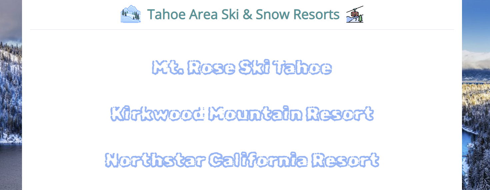

# 100 Days of Code Day 96: Ski Resort Weather Website (Custom API Based Website)
## Technologies Used
Open Weather Map 5-Day Forecast API
[Open Weather Map](https://openweathermap.org/api) API is used to retrieve weather data for each of the ski resorts that are passed through in this project. In order to use the API, each resort's longitude and latitude data are passed through. For this project, the [5-day forecast API endpoint](https://openweathermap.org/forecast5) is used.
## Modules Used
### Requests
**Requests** is used to query the Open Weather Map API endpoint.
### Os & Dotenv
**Os** and **dotenv** are used to load the environment variables from the .env file.
### Flask & Flask Bootstrap
**Flask** and **flask bootstrap** are used to load the Flask web app.
### Datetime
**Datetime** is used to format the datetime data that is retrieved from the OpenWeatherMap API call. The formatted datetime value is what is displayed to the user when they select a Ski resort.
## Project Files
### Static Folder
The static folder contains assets used by the website. This includes images and CSS styling.
### Templates Folder
This website contains 4 template files. Two of which are the header and footer. The other files render the home page and display the weather data for a resort when it is selected. 
Screenshots of both pages are depicted in the **Project Screenshots** section.
### weatherdata.py
**Weatherdata.py** pulls the weather data for each resort that is stored in the **RESORT_COORDINATES constant**. The constants are static however, if you have more appropriate locations, that data can be swapped out!

The page has two additional functions. **Pull_weather_data** queries the API endpoint using the coordinates passed through. **Generate_tables** takes the data passed through and returns a list of formatted data. This data is used rendered when a resort page is loaded.
### weatherpages.py
All the heavy lifting in this project is completed in weatherdata.py. **Weatherpages.py** is responsible for loading the Flask routes and pages. The routes used are the home page and the resorts route, which renders the selected resorts' weather data.
## Project Walkthrough 
This was an interesting project to complete and utilized concepts learned throughout the course, including working with APIs and creating Flask web apps. Since I live near Lake Tahoe, there are plenty of ski resorts where I live, so I decided to create a website that displays weather data for the resorts using **Open Weather Maps 5 5-day weather forecast API**.

The program starts by connecting to the Open Weather Map 5 Day Forecast endpoint and collecting weather data for the specified coordinates. This is accomplished using a loop to iterate through all the coordinates and pass them through the **pull_weather_data function**. 

The data retrieved from the pull_weather_data function is then passed through a separate function called **generate_tables**. The generate_tables function takes the data that is returned and formats it to the format used in the ski resort website. 

The generated tables are imported into **webpages.py**. This file renders the web pages used in the website. When the user navigates to the home page, they are presented with the names of all the ski resorts that are passed in from the weatherdata.py file. 

When a user selects an individual ski resort, they are redirected to a page that displays weather data for each individual ski resort. On the page, there is also a link to the selected resort!

## Project Screenshots

